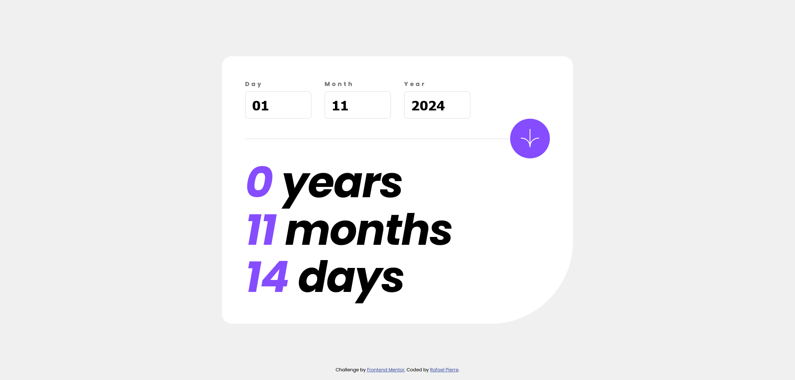

# Frontend Mentor - Age calculator app solution

This is a solution to the [Age calculator app challenge on Frontend Mentor](https://www.frontendmentor.io/challenges/age-calculator-app-dF9DFFpj-Q). Frontend Mentor challenges help you improve your coding skills by building realistic projects. 

## Table of contents

- [Overview](#overview)
  - [The challenge](#the-challenge)
  - [Screenshot](#screenshot)
  - [Links](#links)
- [My process](#my-process)
  - [Built with](#built-with)
- [Author](#author)

## Overview

I've decided to study the fullstack roadmap from the bottom up. For this challenge, In this challenge, I focused on Vanilla JavaScript and SCSS, aiming to practice component-based workflows and custom form validation.

This project was a great opportunity to apply what I've been learning and reinforce my understanding of DOM manipulation, styling with SCSS, and modular code organization. Next stop: Object-Oriented Programming in Vanilla JavaScript!

### The challenge

Users should be able to:

- Display an age in years, months, and days after submitting a valid date through the form;
- See the optimal layout for the interface depending on their device's screen size;
- See the age numbers animate to their final number when the form is submitted;

### Screenshot

### Links

- Live Site URL: [Github Pages](https://ropierre.github.io/frontend-mentor_Recipe-page/)
- Solution URL: [Github]()

## My process

### Learnings

- Used CSS Grid to improve spacing, even in single-direction layouts;
- Organized SCSS using partials for cleaner structure;
- Implemented form validation with custom logic;
- Applied ES module syntax (`export`/`import`) for modular code;

### Built with

- Semantic HTML5 markup
- SCSS (Sass)
- Vanilla JavaScript
- Component-based workflow

### Continued development

I'm planning to dive deeper into Vanilla JavaScript, especially Object-Oriented Programming (OOP), and continue refining my SCSS skills through future challenges.

## Author

- GitHub - [Rafael Pierre](https://github.com/ROPierre)
- Frontend Mentor - [@ROPierre](https://www.frontendmentor.io/profile/ROPierre)